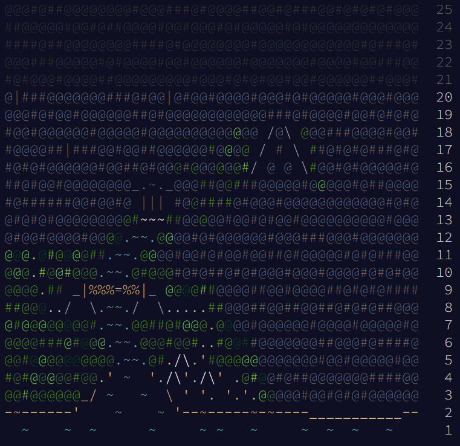

# AdventOfCode2022

Python solutions for [Advent of Code 2022](https://adventofcode.com/2022/about).

## What is Advent of Code?

From the Advent of Code site:

> Advent of Code is an Advent calendar of small programming puzzles for a variety of skill sets and skill levels that can be solved in any programming language you like. People use them as interview prep, company training, university coursework, practice problems, a speed contest, or to challenge each other.

## Calendar Progress

## Solutions
|  | Part 1 | Part 2 |
| :-- | :-------------: | :-------------: |
| [Day 1: Calorie Counting](/days/01) | [Solution](/days/01/part1.py) | [Solution](/days/01/part2.py) |
| [Day 2: Rock Paper Scissors](/days/02) | [Solution](/days/02/part1.py) | [Solution](/days/02/part2.py) |
| [Day 3: Rucksack Reorganization](/days/03) | [Solution](/days/03/part1.py) | [Solution](/days/03/part2.py) |
| [Day 4: Camp Cleanup](/days/04) | [Solution](/days/04/part1.py) | [Solution](/days/04/part2.py) |
| [Day 5: Supply Stacks](/days/05) | [Solution](/days/05/part1.py) | [Solution](/days/05/part2.py) |
| [Day 6: Tuning Trouble](/days/06) | [Solution](/days/06/part1.py) | [Solution](/days/06/part2.py) |
| [Day 7: No Space Left On Device](/days/07) | [Solution](/days/07/part1.py) | [Solution](/days/07/part2.py) |
| [Day 8: Treetop Tree House](/days/08) | [Solution](/days/08/part1.py) | [Solution](/days/08/part2.py) |
| [Day 9: Rope Bridge](/days/09) | [Solution](/days/09/part1.py) | [Solution](/days/09/part2.py) |
| [Day 10: Cathode-Ray Tube](/days/10) | [Solution](/days/10/part1.py) | [Solution](/days/10/part2.py) |
| [Day 11: Monkey in the Middle](/days/11) | [Solution](/days/11/part1.py) | [Solution](/days/11/part2.py) |
| [Day 12: Hill Climbing Algorithm](/days/12) | [Solution](/days/12/part1.py) | [Solution](/days/12/part2.py) |
| [Day 13: Distress Signal](/days/13) | [Solution](/days/13/part1.py) | [Solution](/days/13/part2.py) |
| [Day 14: Regolith Reservoir](/days/14) | [Solution](/days/14/part1.py) | [WIP](/days/14/part2.py) |
| [Day 15: Beacon-Exclusion Zone](/days/15) | [Solution](/days/15/part1.py) | [Solution](/days/15/part2.py) |
| [Day 16: Proboscidea Volcanium](/days/16) | TODO | TODO |
| [Day 17: Pyroclastic Flow](/days/17) | TODO | TODO |
| [Day 18: Boiling Boulders](/days/18) | TODO | TODO |
| [Day 19: Not Enough Minerals](/days/19) | TODO | TODO |
| [Day 20: Grove Positioning System](/days/20) | TODO | TODO |

## Disclaimer

All puzzles and calendar design property of Advent of Code.
